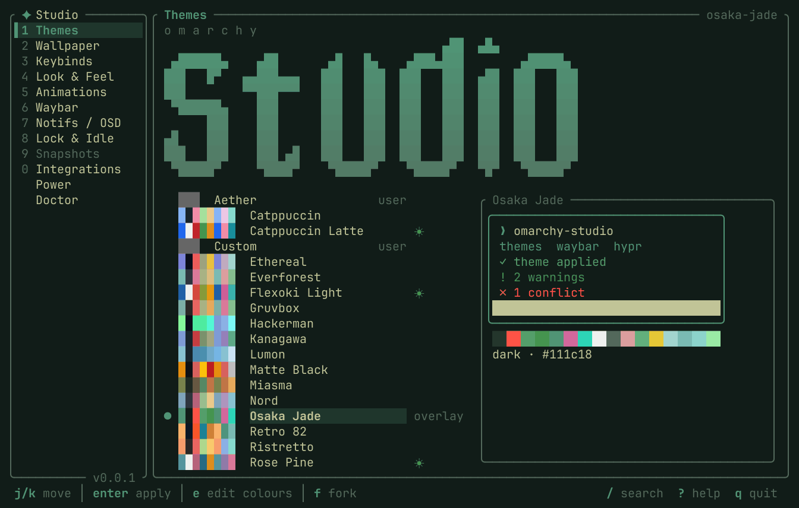
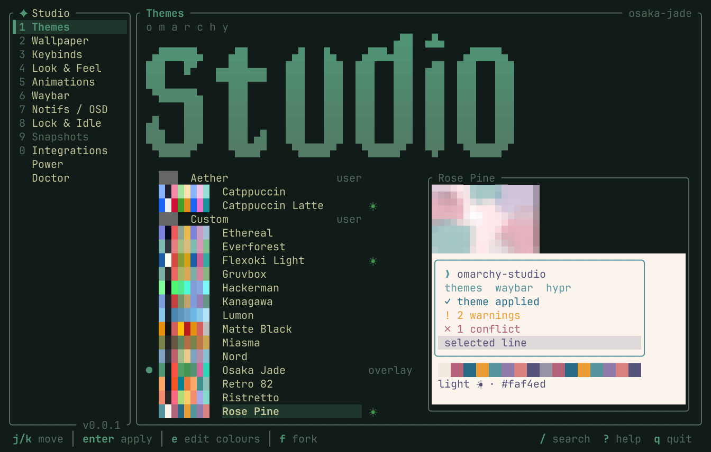
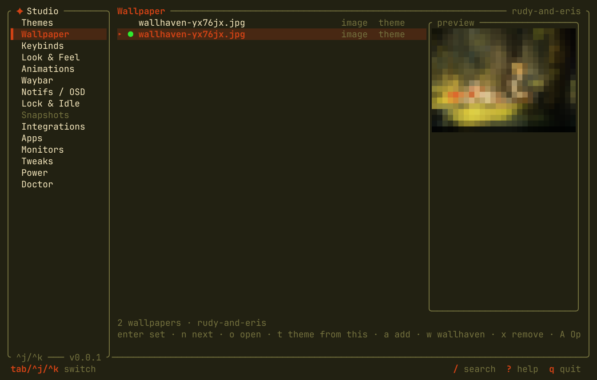
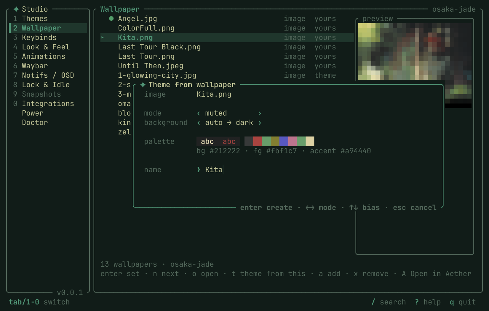
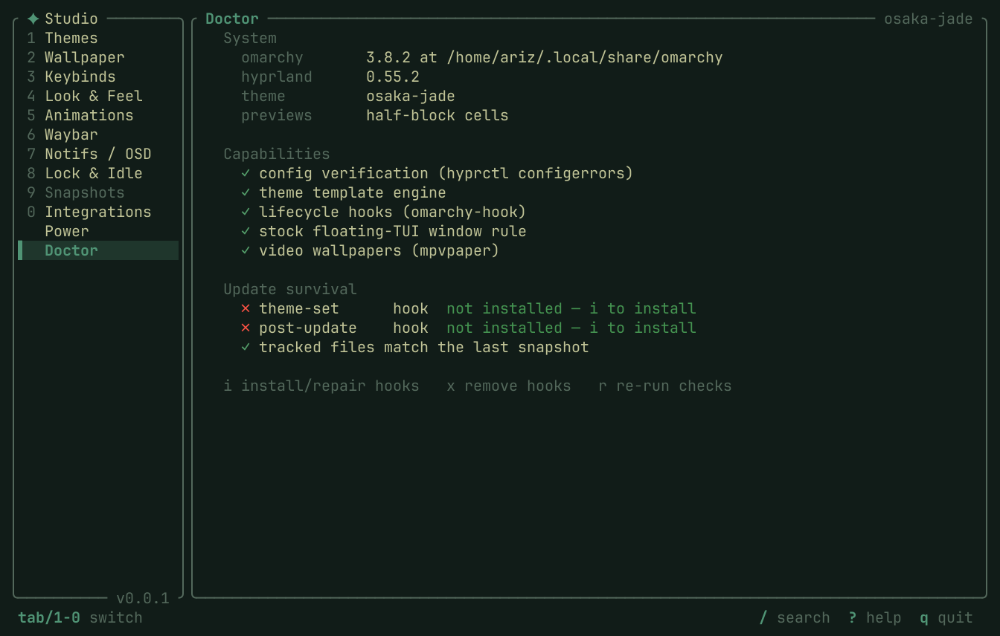

# Omarchy Studio

**The one-stop theming cockpit for [Omarchy](https://omarchy.org)** — themes, palettes, keybinds, look & feel, animations, Waybar, notifications, OSD, and lock/idle, all editable from a keyboard-driven TUI (or scriptable CLI) with git-backed one-key undo. No config-file jargon required — but the raw file is always one keystroke away.



> **Status: alpha.** The modules below are built, tested (174 tests green), and drive the real Omarchy config on disk — v0.1 through v0.6 of the roadmap are complete and v0.7 (community asks) is underway. Tested against Omarchy 3.8.

## Why

Omarchy's menu covers *picking* a theme; everything past that is hand-editing five config dialects across four directory trees, with no discoverability and no undo. The community solved colors six times over — nobody built the control center for the *behavioral* half: keybinds, animations, bar layout, notification behavior. Studio does both, natively, and integrates with the tools that already exist.

## What works today

| Module | What you can do | Since |
|---|---|---|
| **Themes** | List, show current, apply, fork — with a live preview pane: the theme's wallpaper + a mock terminal drawn in its palette | v0.1 |
| **Keybinds** | Browse and rebind Hyprland keybindings, live capture | v0.2 |
| **Look & Feel** | Gaps, borders, rounding, opacity and other Hyprland variables | v0.3 |
| **Animations** | Apply curated animation presets | v0.3 |
| **Waybar** | Reorder/add/remove modules across lanes, tweak settings, font-size & radius, build custom modules — with a crash-watchdog that auto-reverts a config that kills the bar | v0.4 |
| **Notifications (mako)** | Behavior schema (timeouts, layout, urgency rules), do-not-disturb, live sample notifications | v0.5 |
| **OSD (swayosd)** | Volume/brightness popup geometry, percentage, margins, self-test | v0.5 |
| **Lock & Idle** | Retime the hypridle timeline (screensaver → lock → screen-off → suspend), hyprlock avatar/blur/dim | v0.5 |
| **Update survival** | Lifecycle hooks (`theme-set`, `post-update`) re-assert Studio's style blocks after theme changes and flag drift/clobbers after `omarchy-update` | v0.5 |
| **Doctor** | One health view: system facts, capability probes, hook status, drift report — in the TUI and the CLI | v0.5 |
| **Wallpapers** | Browse all four background sources (yours / theme / videos) with in-terminal previews (kitty / sixel / half-blocks), set/cycle/add/remove, `o` opens in imv/mpv | v0.6 |
| **Palette extraction** | Median-cut engine: image → full `colors.toml` (normal / muted / material modes, dark/light bias, WCAG-safe) | v0.6 |
| **Theme wizard** | `t` on any wallpaper (or `theme new --from-image`): live extraction → named, 100 % standard theme dir with preview.png | v0.6 |
| **wallhaven** | Browse wallhaven.cc without leaving the TUI (`w` in Wallpapers): live search, sort/ratio/color-match filters, thumbnail previews, download-and-set or feed straight into the theme wizard — plus the same search on the CLI | v0.6–0.7 |
| **Integrations** | Dependency health + companion-tool detection (Aether, Omarchist, matugen, hyprmon) with launch actions; "Open in Aether" appears in the wallpaper browser when installed | v0.6 |
| **Power** | Battery charge thresholds on ThinkPads & friends (`charge_control_*_threshold`) — no TLP needed; CLI can persist them across reboots | v0.6 |
| **Self-update** | Daily release check; `U` in the TUI (or `omarchy-studio update`) downloads, swaps, and restarts — hands off to pacman for packaged installs | v0.7 |

Every change is snapshotted to a git-backed history — undo with a single command or key.

Wondering how Studio relates to A La Carchy? See the honest, source-verified [comparison](docs/comparison.md); the gaps it found drive the [v0.8 roadmap](ROADMAP.md).

| | |
|---|---|
|  |  |
|  |  |

## Install

Requires a Rust toolchain (1.96+) and an Omarchy system (Arch + Hyprland).

```bash
git clone https://github.com/arino08/omarchy-studio
cd omarchy-studio
cargo build --release
# binary at ./target/release/omarchy-studio — copy it onto your PATH:
install -Dm755 target/release/omarchy-studio ~/.local/bin/omarchy-studio
```

Optional — add Studio to the Omarchy menu as a floating terminal app:

```bash
omarchy-studio install-integration    # undo with: omarchy-studio uninstall
```

Recommended — install the update-survival hooks so Studio's changes live through theme switches and `omarchy-update`:

```bash
omarchy-studio hooks install          # undo with: omarchy-studio hooks remove
```

## Updating

Studio keeps itself current. On launch the TUI checks GitHub for a newer release (once a day, off-thread, silent when offline); when one exists the keybar shows **`U` update!** — press it and Studio downloads the release binary, swaps it in place, and restarts itself. The same flow is scriptable:

```bash
omarchy-studio update           # check + install + tell you to restart
omarchy-studio update --check   # just report
```

If the binary is owned by a pacman package (AUR install), Studio never touches it — it tells you to update through your package manager instead. Two knobs in `~/.config/omarchy-studio/config.toml`:

```toml
[update]
check = false   # disable the launch check entirely
auto = true     # swap + restart without waiting for U
```

## Quick start — the TUI

```bash
omarchy-studio          # launch the full-screen cockpit
```

| Key | Action |
|---|---|
| `Tab` / `Shift-Tab` | next / previous module |
| `1`–`9`, `0` | jump straight to a module |
| `j` / `k`, arrows | move within a screen |
| `h` / `l` | adjust the selected value |
| `Enter` | open a picker (avatar, theme, …) |
| `t` | (wallpapers) craft a theme from the selected image |
| `w` | (wallpapers) browse wallhaven.cc — enter sets, `t` themes |
| `o` | (wallpapers) open in imv / mpv |
| `s` | save pending edits (snapshotted first) |
| `U` | install a waiting update & restart |
| `/` | search · `?` help · `q` quit |

Studio themes itself from your active Omarchy theme — panels, highlights, and the wordmark all re-tint with every theme switch. The one not-yet-built screen (the Snapshots browser) shows an honest "arriving in …" placeholder rather than a broken UI.

## CLI reference

Everything the TUI does is scriptable. Each mutating command prints its undo hint.

```bash
# Themes
omarchy-studio theme list | current | apply <name> | fork <src> <new>
omarchy-studio theme new <name> --from-image <path> [--mode normal|muted|material] [--bias auto|dark|light] [--apply]
omarchy-studio theme extract <image> [normal|muted|material] [auto|dark|light]

# Wallpapers
omarchy-studio wallpaper list | current | set <n|name|path> | next | add <file> | remove <name>
omarchy-studio wallpaper wallhaven search <query> [--color <hex>] [--ratio 16x9] [--top] [--page N] [--download <n>]

# Snapshots / undo
omarchy-studio snapshot list | undo | restore <id>

# Look & Feel
omarchy-studio looknfeel list | get <key> | set <key> <value>

# Animations
omarchy-studio animations list | current | apply <name>

# Presets (bundled look & feel + animation combos)
omarchy-studio preset list | try <name> | apply <name>

# Toggles
omarchy-studio toggle <name>

# Waybar
omarchy-studio waybar modules
omarchy-studio waybar add <lane> <id> | remove <lane> <id> | move <id> <lane>
omarchy-studio waybar set <path> <value>
omarchy-studio waybar new <name> --exec <cmd> [--interval N] [--format F] [--on-click C] [--lane left|center|right]
omarchy-studio waybar style show | font-size <n> | radius <n> | reset

# Notifications (mako)
omarchy-studio notif list | get <key> | set <key> <value>
omarchy-studio notif rule add <crit> <action> | rule remove <n>
omarchy-studio notif dnd on|off|status | test low|normal|critical

# OSD (swayosd)
omarchy-studio osd show
omarchy-studio osd set show-percentage <on|off> | max-volume <n> | top-margin <0..1> | radius <n> | font <pt>
omarchy-studio osd test

# Lock & Idle
omarchy-studio idle timeline
omarchy-studio idle set <screensaver|lock|screen-off|suspend> <seconds>
omarchy-studio lock show | avatar <path> | avatar list | size <px> | blur <n> | dim <0..1> | preview

# Battery charge thresholds (ThinkPads & friends — no TLP needed)
omarchy-studio battery [status]
omarchy-studio battery limit <start> <stop> [--persist]   # --persist under sudo survives reboots

# Update-survival hooks
omarchy-studio hooks install | remove | status

# Self-update (defers to pacman for packaged installs)
omarchy-studio update [--check]

# Health check (--quiet: terse drift report, exit 1 when something needs a look)
omarchy-studio doctor [--deps] [--quiet]
```

## Design pillars

1. **Never fight Omarchy** — write only to user-owned files and sanctioned extension surfaces; apply through `omarchy-theme-set` / `omarchy-theme-refresh` / `omarchy-restart-*`.
2. **The file is still the truth** — comment-preserving, span-splice edits; your hand-edits and Studio's edits coexist byte-for-byte.
3. **Show, don't describe** — live preview and confirm-or-revert; a Waybar config that crashes the bar rolls itself back.
4. **Undo is sacred** — git-backed snapshots of every change Studio makes.
5. **Never strand the user** — a missing dependency is a visible-but-disabled feature with the exact install command, never a silent failure.

## Repository map

| Path | What |
|---|---|
| `docs/PRD.md` | Product requirements — the *what* and *why* |
| `docs/specs/` | Build specs — the *how* (start at `00-overview.md`) |
| `ROADMAP.md` | Milestones broken into issue-sized tasks |
| `docs/comparison.md` | How Studio compares to A La Carchy |
| `docs/handoff-v0.8.md` | Architecture guide for the v0.8/v0.9 milestones |
| `crates/studio-core/` | Engine library: config model, comment-preserving parsers, apply pipeline, snapshots, Omarchy adapter |
| `crates/omarchy-studio/` | The binary: TUI + CLI frontends |
| `tools/termshot/` | Renders tmux captures to the README media (screenshots + tour GIF) |
| `data/` | Bundled presets and the integrations registry |

## License

MIT.
